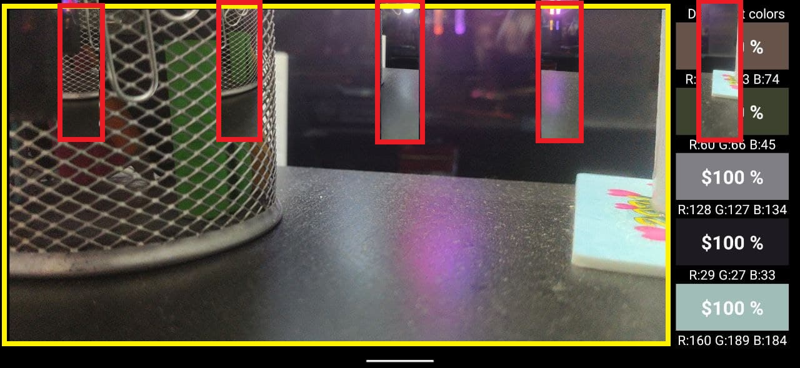
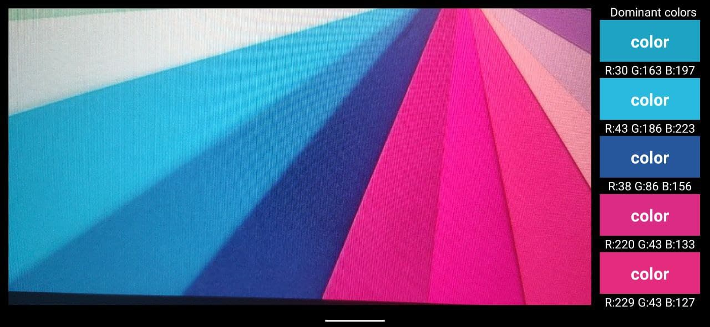
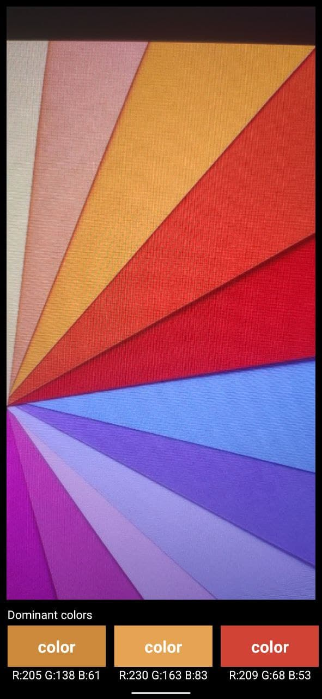
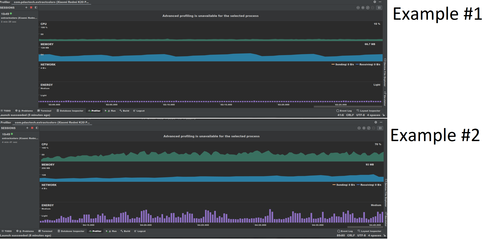

# FindColors
## Android project for PDACTECH
### Autor: Pavel Maltsev
### Created: 04.07.2021

#### Tech stack of android application:
- BitmapConverter (Created by @art from https://www.py4u.net/discuss/615533)
- Kotlin
- CameraX
- MVVM
- ViewBinding
- LiveData
- AndroidTests

#### Short explanation what app can do:
The application works in real time,
it takes an image from the camera.  
Performs various actions with it,
such as:
- Looking for most popular color in the image.
- Display RGB value of this color
- Display percent value of this color in image

### Screenshot explanation:
   - Screenshot 1:
     - In the screenshot at number one you can see how the division
       of the main image into 5 small.  
      **Yellow** rectangle demonstrate the main image  
      **Red** rectangles demonstrate 5 equal parts of main image

#### Screenshot 1
 

- Screenshot 2:
     - Screenshot number two demonstrates the **landscope mode** of app

#### Screenshot 2

- Screenshot 3:
     - Screenshot number three demonstrates the **portrait mode** of app

#### Screenshot 3

- Screenshot 4:
     - Screenshot number four demonstrates the application in real time.  
       If we start landscope mode and portrait mode a large number of times.  
       Then the application requires more resources for correct operation.  
       There are several ways to solve this problem:
        - The main load on the application is the method to get percentages of color (getPercentsOfCurrentColor())  
          we can reduce the number of pixels so that the application worked faster but then the calculation will be inaccurate.
        - There is also a Garbage collector that helps us solve this problem

#### Screenshot 4

#### End.
##### Thanks for your attention!

